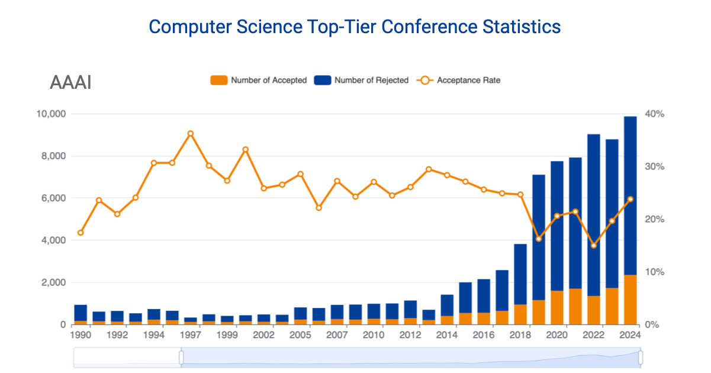

# Computer Science Conference Statistics

Here you can browse the acceptance rate and number of submissions each year for top-tier CS conferences.

Click -> [Live Website](https://csconfstats.xoveexu.com/)



Also, I create several fun visualizations about these conferences. 

Click -> [Fun Visualizations](https://csconfstats.xoveexu.com/fun-fact.html)

PS: I am constantly adding more conferences. 

## Catalog

Number of submissions and number of accepted papers for the following conferences:

1. AAAI: AAAI Conference on Artificial Intelligence.
1. ACL: Annual Meeting of the Association for Computational Linguistics.
1. ACM MM: ACM International Conference on Multimedia.
1. HCI: ACM Conference on Human Factors in Computing Systems.
1. CIKM: ACM International Conference on Information and Knowledge Management.
1. CSCW: ACM Conference on Computer-Supported Cooperative Work and Social Computing.
1. CVPR: International Conference on Computer Vision and Pattern Recognition.
1. ECCV: European Conference on Computer Vision.
1. ECIR: European Conference on Information Retrieval.
1. ICASSP: IEEE International Conference on Acoustics, Speech, and Signal Processing
1. ICCV: International Conference on Computer Vision.
1. ICDE: International Conference on Data Engineering.
1. ICDM: International Conference on Data Mining.
1. ICLR: International Conference on Learning Representations.
1. ICME: IEEE International Conference on Multimedia and Expo.
1. ICML: International Conference on Machine Learning.
1. ICMR: ACM International Conference on Multimedia Retrieval.
1. ICWSM: International AAAI Conference on Web and Social Media.
1. IJCAI: International Joint Conference on Artificial Intelligence.
1. INFOCOM: IEEE International Conference on Computer Communications.
1. INTERSPEECH: Conference of the International Speech Communication Association.
1. MobiCom: International Conference on Mobile Computing and Networking.
1. MobiSys: ACM International Conference on Mobile Systems, Applications, and Services.
1. NeurIPS: Conference on Neural Information Processing Systems.
1. NSDI: USENIX Symposium on Networked Systems Design and Implementation.
1. PODS: ACM Symposium on Principles of Database Systems.
1. SDM: SIAM International Conference on Data Mining.
1. SenSys: ACM Conference on Embedded Networked Sensor Systems.
1. SIGCOMM: Annual Conference of the ACM SIGCOMM on the Applications, Technologies, Architectures, and Protocols for Computer Communication
1. SIGIR: International ACM SIGIR Conference on Research and Development in Information Retrieval.
1. SIGKDD: ACM SIGKDD Conference on Knowledge Discovery and Data Mining.
1. TheWebConf: The Web Conference.
1. UbiComp: ACM International Joint Conference on Pervasive and Ubiquitous Computing.
1. UIST: ACM Symposium on User Interface Software and Technology.
1. VLDB: International Conference on Very Large Data Bases.
1. WSDM: ACM International Conference on Web Search and Data Mining.


## If You Know

If you know some stats of the conferences listed in [this file](./If-You-Know.md), you can send them to us. 

## CSS Compile

Using `tailwindcss` and `npm`:
```shell
npx tailwindcss -i ./src/input.css -o output.css --watch
```

# Contact

For adding more data, correcting existing data or code, or suggesting stuffs, please open issues, PRs, or contact me at `xovee.xu at gmail.com`. 